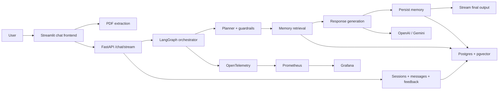

# ApplyGraph

ApplyGraph is a session-based AI job copilot that helps a candidate compare their resume to a role, tailor resume content, draft outreach, and keep each conversation’s resume context and semantic memory isolated.

It is built as a streaming FastAPI + LangGraph backend with a Streamlit chat UI, Postgres + pgvector memory, OpenTelemetry observability, a custom eval harness, and human feedback capture.

## Why this project is strong

This is not just a prompt wrapper. It includes the parts companies actually need to ship an AI product:

- session-scoped chat threads with persisted history
- semantic memory retrieval with pgvector
- single-prompt routing and guardrails
- streaming workflow progress over SSE
- multi-provider LLM support (OpenAI / Gemini)
- custom regression evals with optional LLM-as-judge scoring
- OpenTelemetry, Prometheus, and Grafana instrumentation
- human feedback capture on assistant responses

## Product capabilities

- Upload one resume PDF per chat session
- Ask free-form questions like:
  - “Would I be a fit for this role?”
  - “Tailor my resume for this backend job”
  - “Write me an email to the hiring manager”
- Stream stage-by-stage workflow progress in the UI
- Persist messages, resume context, semantic memory, and feedback per session
- Reject off-topic prompts before they hit downstream generation

## Architecture



## Tech stack

- Backend: FastAPI, LangGraph, SQLAlchemy
- Frontend: Streamlit
- LLMs: OpenAI, Gemini
- Memory: PostgreSQL, pgvector
- Observability: OpenTelemetry, Prometheus, Grafana
- Evaluation: custom Python eval harness

## Current request model

The active flow is session-based, not user-id based.

Each chat session owns:

- title
- message history
- uploaded resume text
- semantic memory
- per-response feedback

The frontend sends only:

```json
{
  "session_id": "uuid",
  "message": "Analyze this role against my resume."
}
```

The backend loads the session resume and memory automatically.

## Main endpoints

- `GET /health`
- `POST /sessions`
- `GET /sessions`
- `GET /sessions/{session_id}`
- `PATCH /sessions/{session_id}/resume`
- `DELETE /sessions/{session_id}`
- `POST /sessions/{session_id}/messages/{message_id}/feedback`
- `POST /chat/stream`

## Example stream call

```bash
curl -N -X POST http://localhost:8000/chat/stream \
  -H "Content-Type: application/json" \
  -H "Accept: text/event-stream" \
  -d '{
        "session_id": "11111111-1111-1111-1111-111111111111",
        "message": "Would I be a fit for this backend platform role?"
      }'
```

Example final event:

```text
data: {"type":"final","data":{"request_type":"analyze_job","output":{"response":"...","retrieved_memory":[]}}}
```

## Local setup

### Requirements

- Python 3.11+
- Docker + Docker Compose
- Postgres with pgvector if running outside Docker
- OpenAI or Gemini API key for real LLM responses

### Install

```bash
python -m venv .venv
source .venv/bin/activate
pip install --upgrade pip
pip install -e .[dev]
```

### Run the full stack

```bash
docker-compose up --build
```

Services:

- API: [http://localhost:8000](http://localhost:8000)
- Grafana: [http://localhost:3000](http://localhost:3000)
- Prometheus: [http://localhost:9090](http://localhost:9090)

### Run backend locally

```bash
uvicorn backend.main:app --reload
```

### Run frontend locally

```bash
streamlit run frontend/app.py
```

## Evaluation

The project includes a custom eval harness for streamed chat workflows.

Run deterministic evals:

```bash
python evals/run_evals.py --skip-judge
```

Run with LLM-as-judge:

```bash
EVAL_JUDGE_PROVIDER=openai \
EVAL_JUDGE_MODEL=gpt-4.1-mini \
EVAL_JUDGE_OPENAI_API_KEY=your-key \
python evals/run_evals.py
```

The eval suite covers:

- analyze-job flows
- resume-tailoring flows
- outreach flows
- guardrail rejection flows

## Observability

Telemetry is exported through OpenTelemetry.

The local Docker stack includes:

- OTEL collector
- Prometheus scrape path
- Grafana dashboards

Useful metrics include:

- workflow latency
- workflow request counts
- guardrail rejection counts
- LLM latency
- LLM token usage

## Project docs

Focused docs live in `/Users/sameet/Documents/Projects/applygraph/docs`:

- `/Users/sameet/Documents/Projects/applygraph/docs/architecture.md`
- `/Users/sameet/Documents/Projects/applygraph/docs/api.md`
- `/Users/sameet/Documents/Projects/applygraph/docs/frontend.md`
- `/Users/sameet/Documents/Projects/applygraph/docs/evals.md`
- `/Users/sameet/Documents/Projects/applygraph/docs/observability.md`

## Resume-ready summary

Built a session-based AI job copilot using FastAPI, LangGraph, Streamlit, PostgreSQL + pgvector, and OpenAI/Gemini APIs to analyze job fit, tailor resume content, draft outreach, stream workflow progress, persist semantic memory, capture user feedback, and monitor production behavior with OpenTelemetry, Prometheus, and Grafana.
