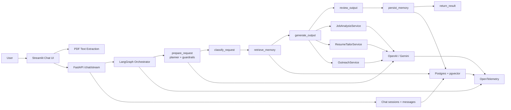

# Architecture

## Overview

ApplyGraph is a session-based AI job copilot with:

- a Streamlit chat frontend
- a FastAPI streaming backend
- a LangGraph workflow orchestrator
- session-scoped memory in Postgres + pgvector
- OpenTelemetry-based observability
- a custom eval harness

## Main Flow

## Backend Layers

### 1. API layer

Located in `/Users/sameet/Documents/Projects/applygraph/backend/api`.

Responsibilities:

- exposes streaming chat endpoint
- exposes session CRUD endpoints
- persists user and assistant messages
- validates `session_id` ownership at the session level

### 2. Workflow layer

Located in `/Users/sameet/Documents/Projects/applygraph/backend/workflows`.

Current LangGraph stages:

1. `prepare_request`
2. `classify_request`
3. `retrieve_memory`
4. `generate_output`
5. `review_output`
6. `persist_memory`
7. `return_result`

Notes:

- parser/profile-reader stages were removed from the critical path
- requests are routed from one free-form prompt
- off-topic prompts are rejected before downstream generation

### 3. Service layer

Located in `/Users/sameet/Documents/Projects/applygraph/backend/services`.

Key services:

- `ChatPlannerService` - routing, guardrails, slot extraction
- `JobAnalysisService` - generic job-analysis answer generation
- `ResumeTailorService` - generic resume-tailoring answer generation
- `OutreachService` - outreach copy generation
- `MemoryService` - session-scoped semantic memory persistence and retrieval
- `ChatSessionService` - session, message, resume, and feedback persistence

### 4. Persistence layer

Located in `/Users/sameet/Documents/Projects/applygraph/backend/db`.

Current primary models:

- `ChatSession`
- `ChatSessionMessage`
- `ChatMessageFeedback`
- `SessionMemoryChunk`

Important distinction:

- `ChatSessionMessage` stores visible thread history
- `SessionMemoryChunk` stores semantic memory used for retrieval

### 5. Frontend layer

Located in `/Users/sameet/Documents/Projects/applygraph/frontend`.

Responsibilities:

- manage multi-session chat UX
- upload one resume per session
- extract PDF text client-side
- send prompts to the streaming backend
- render stage updates and final responses
- capture message-level feedback

## Session Model

The app is no longer user-id based in the active flow.

All state is scoped to a `session_id`.

Each session owns:

- title
- message history
- uploaded resume metadata and extracted text
- semantic memory
- feedback on assistant responses

This gives ChatGPT-style thread isolation.
