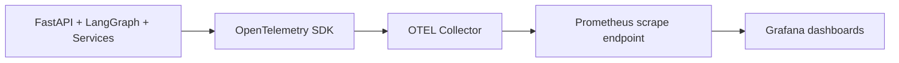

# Observability

## Overview

The project emits traces and metrics through OpenTelemetry and ships a local Prometheus + Grafana stack through Docker Compose.

## Data Path



## Components

- `/Users/sameet/Documents/Projects/applygraph/backend/telemetry/tracing.py`
- `/Users/sameet/Documents/Projects/applygraph/backend/telemetry/metrics.py`
- `/Users/sameet/Documents/Projects/applygraph/otel-collector-config.yaml`
- `/Users/sameet/Documents/Projects/applygraph/prometheus.yml`
- `/Users/sameet/Documents/Projects/applygraph/docker-compose.yml`

## Current Metrics

Examples:

- workflow request counts
- workflow latency
- LLM latency
- LLM token usage
- guardrail rejection counts

## Local Stack

Start:

```bash
docker-compose up --build
```

Local endpoints:

- Grafana: [http://localhost:3000](http://localhost:3000)
- Prometheus: [http://localhost:9090](http://localhost:9090)
- OTEL collector metrics: [http://localhost:9464/metrics](http://localhost:9464/metrics)

## Notes

- Grafana reads from Prometheus
- Prometheus scrapes the OTEL collector
- the app exports telemetry to the collector via OTLP
- if the collector is absent, local runs may still work but telemetry may degrade or log warnings
